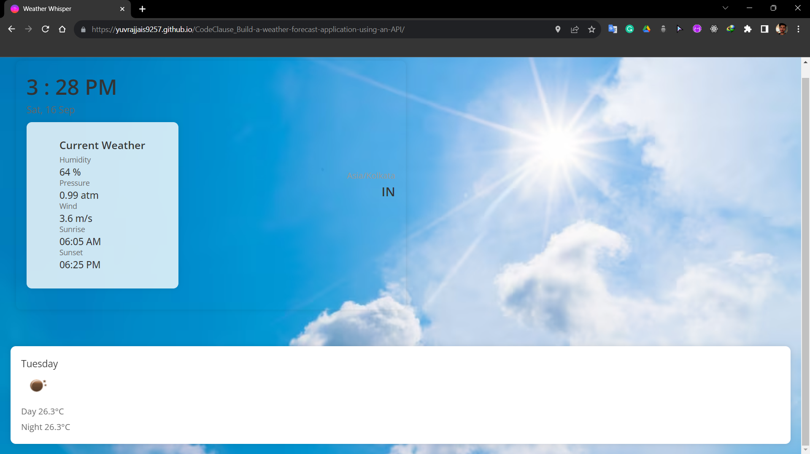

# Weather Forecasting Web App





A simple web application that provides real-time weather forecasts for different locations. The app is built using HTML, CSS, JavaScript, Node.js, Express.js, Nodemon, and the OpenWeatherMap API.

## Table of Contents

- [Demo](#demo)
- [Features](#features)
- [Installation](#installation)
- [Usage](#usage)
- [API Key](#api-key)
- [Contributing](#contributing)
- [License](#license)

## Demo

You can see a live demo of the app here: [Live Demo](https://yuvrajjais9257.github.io/CodeClause_Build-a-weather-forecast-application-using-an-API/)

## Features

- View current weather conditions, temperature, and description for a specified location.
- Search for weather information by city name or zip code.
- Responsive design for a seamless experience on both desktop and mobile devices.

## Installation

To run this project locally, follow these steps:

1. Clone this repository to your local machine:

    ```bash
    git clone https://github.com/your-username/weather-forecast-app.git

2. Navigate to the project directory:

    ```bash
    cd weather-forecast-app

3. Install the project dependencies using npm:

    ```bash
    npm install

4. Start the development server:

    ```bash
    npm start

5. The app will be available  at [here](http://localhost:3000)!

## Usage

Once the app is running, you can access it through your web browser. Enter a city name or zip code in the search bar and press the "Search" button to get the weather forecast for that location.

## API Key
To use the OpenWeatherMap API, you'll need to sign up for an API key. Follow these steps to obtain an API key:
1. Visit the OpenWeatherMap website.
2. Sign up for a free account or log in if you already have one.
3. Once logged in, go to your account dashboard and find the API keys section.
4. Generate a new API key.

## Contributing:

Contributions are welcome! If you'd like to contribute to this project, please follow these steps:

1. Fork the repository.
2. Create a new branch for your feature or bug fix.
3. Make your changes and commit them with descriptive commit messages.
4. Push your branch to your forked repository.
5. Create a pull request to the main repository.

# Contact:
Feel free to contact Me [here](quicksilver92571331@gmail.com)!
